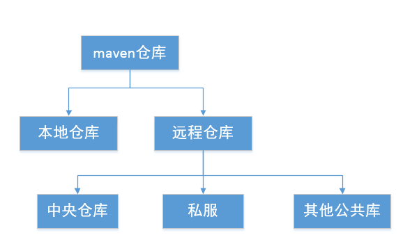

# maven 学习

## 一个简单文件pom文件
```xml
<?xml version="1.0" encoding="UTF-8"?>
<project xmlns="http://maven.apache.org/POM/4.0.0"
         xmlns:xsi="http://www.w3.org/2001/XMLSchema-instance"
         xsi:schemaLocation="http://maven.apache.org/POM/4.0.0 http://maven.apache.org/xsd/maven-4.0.0.xsd">
    <modelVersion>4.0.0</modelVersion>
    <groupId>com.zxiaoyao.mvn</groupId>
    <artifactId>hello-world</artifactId>
    <version>1.0.-SNAPSHOT</version>
    <name>Maven Hello World Project</name>
    <properties>
        <project.build.sourceEncoding>UTF-8</project.build.sourceEncoding>
    </properties>
    <dependencies>
        <dependency>
            <groupId>junit</groupId>
            <artifactId>junit</artifactId>
            <version>4.11</version>
            <scope>test</scope>
        </dependency>
        <dependency>
            <groupId>junit</groupId>
            <artifactId>junit</artifactId>
            <version>RELEASE</version>
        </dependency>

    </dependencies>

    <build>
        <plugins>
            <!-- 在meta-inf文件夹的 manifest中加入主执行类 -->
            <plugin>
                <groupId>org.apache.maven.plugins</groupId>
                <artifactId>maven-shade-plugin</artifactId>
                <version>3.0.0</version>
                <!--避免生成 dependencyReducePom文件 -->
                <configuration>
                    <createDependencyReducedPom>false</createDependencyReducedPom>
                </configuration>
                <executions>
                    <execution>
                        <phase>package</phase>
                        <goals>
                            <goal>shade</goal>
                        </goals>
                        <configuration>
                            <transformers>
                                <transformer implementation="org.apache.maven.plugins.shade.resource.ManifestResourceTransformer">
                                    <mainClass>com.zxiaoyao.mvn.helloworld.HelloWorld</mainClass>
                                </transformer>

                            </transformers>
                        </configuration>
                    </execution>
                </executions>
            </plugin>

        </plugins>

    </build>

</project>
```

## 使用Archetype生成项目骨架
maven项目中有一些约定，例如 Hello World 项目中约定：在项目的根目录中放置pom.xml，在src/main/java目录中放置项目的主代码，在src/test/java中放置测试代码。
这些基本的文件结构和pom.xml文件内容称为项目的骨架。

使用 mvn archetype:generate 创建maven骨架
```text
E:\workspaces\grow-mvn>mvn archetype:generate
[INFO] Scanning for projects...
Downloading from alimaven: http://maven.aliyun.com/nexus/content/repositories/central/org/apache/maven/plugins/maven-archetype-plugin/maven-metadata.xml
...
[INFO]
[INFO] ------------------------------------------------------------------------
[INFO] Building Maven Stub Project (No POM) 1
[INFO] ------------------------------------------------------------------------
[INFO]
[INFO] >>> maven-archetype-plugin:3.0.1:generate (default-cli) > generate-sources @ standalone-pom >>>
[INFO]
[INFO] <<< maven-archetype-plugin:3.0.1:generate (default-cli) < generate-sources @ standalone-pom <<<
[INFO]
[INFO]
[INFO] --- maven-archetype-plugin:3.0.1:generate (default-cli) @ standalone-pom ---
[INFO] Generating project in Interactive mode
[WARNING] No archetype found in remote catalog. Defaulting to internal catalog
[INFO] No archetype defined. Using maven-archetype-quickstart (org.apache.maven.archetypes:maven-archetype-quickstart:1.0)
Choose archetype:
1: internal -> org.apache.maven.archetypes:maven-archetype-archetype (An archetype which contains a sample archetype.)
2: internal -> org.apache.maven.archetypes:maven-archetype-j2ee-simple (An archetype which contains a simplifed sample J2EE application.)
3: internal -> org.apache.maven.archetypes:maven-archetype-plugin (An archetype which contains a sample Maven plugin.)
4: internal -> org.apache.maven.archetypes:maven-archetype-plugin-site (An archetype which contains a sample Maven plugin site.
      This archetype can be layered upon an existing Maven plugin project.)
5: internal -> org.apache.maven.archetypes:maven-archetype-portlet (An archetype which contains a sample JSR-268 Portlet.)
6: internal -> org.apache.maven.archetypes:maven-archetype-profiles ()
7: internal -> org.apache.maven.archetypes:maven-archetype-quickstart (An archetype which contains a sample Maven project.)
8: internal -> org.apache.maven.archetypes:maven-archetype-site (An archetype which contains a sample Maven site which demonstrates
      some of the supported document types like APT, XDoc, and FML and demonstrates how
      to i18n your site. This archetype can be layered upon an existing Maven project.)
9: internal -> org.apache.maven.archetypes:maven-archetype-site-simple (An archetype which contains a sample Maven site.)
10: internal -> org.apache.maven.archetypes:maven-archetype-webapp (An archetype which contains a sample Maven Webapp project.)
Choose a number or apply filter (format: [groupId:]artifactId, case sensitive contains): 7:
Downloading from alimaven: http://maven.aliyun.com/nexus/content/repositories/central/org/apache/maven/archetypes/maven-archetype-quickstart/1.1/maven-archetype-quickstart-1.1.pom
....
Define value for property 'artifactId': hello-world-1
Define value for property 'version' 1.0-SNAPSHOT: : 1.0-SNAPSHOT
Define value for property 'package' com.zxiaoyao.mvn: :
Confirm properties configuration:
groupId: com.zxiaoyao.mvn
artifactId: hello-world-1
version: 1.0-SNAPSHOT
package: com.zxiaoyao.mvn
 Y: :
[INFO] ----------------------------------------------------------------------------
[INFO] Using following parameters for creating project from Old (1.x) Archetype: maven-archetype-quickstart:1.1
[INFO] ----------------------------------------------------------------------------
[INFO] Parameter: basedir, Value: E:\workspaces\grow-mvn
[INFO] Parameter: package, Value: com.zxiaoyao.mvn
[INFO] Parameter: groupId, Value: com.zxiaoyao.mvn
[INFO] Parameter: artifactId, Value: hello-world-1
[INFO] Parameter: packageName, Value: com.zxiaoyao.mvn
[INFO] Parameter: version, Value: 1.0-SNAPSHOT
[INFO] project created from Old (1.x) Archetype in dir: E:\workspaces\grow-mvn\hello-world-1
[INFO] ------------------------------------------------------------------------
[INFO] BUILD SUCCESS
[INFO] ------------------------------------------------------------------------
[INFO] Total time: 01:31 min
[INFO] Finished at: 2018-12-10T10:23:03+08:00
[INFO] Final Memory: 17M/140M
[INFO] ------------------------------------------------------------------------

```

## 坐标
```text
    <groupId>com.zxiaoyao.mvn</groupId>
    <artifactId>hello-world</artifactId>
    <version>1.0.-SNAPSHOT</version>
    <packaging>jar</packaging>
```
## maven 依赖范围

- compile: 编译依赖范围。默认编译范围。对于编译、测试、运行都有效。
- test: 测试依赖范围。
- provided：已提供依赖范围。编译和测试有效，但运行时无效。例如servlet-api编译和测试有效，运行时 由容器提供。
- runtime:运行时依赖范围。测试和与运行有效，编译时无效。
- system: 系统依赖范围。与provided一样。但是使用system范围的依赖必须通过systemPath显示地指定依赖文件的路径。

依赖范围与classPath的关系：

依赖范围（Scope）|对于编译classPath有效|对于测试classPath有效|对于运行时有效|例子
---|---|---|---|---
compile|Y|Y|Y|spring-core
test|—|Y|—|Junit
provided|Y|Y|—|servlet-api
runtime|—|Y|Y|JDBC驱动实现
system|Y|Y|—|本地的，maven仓库之外的类库文件

### 可选依赖，可选依赖不会被传递

```text
  <dependency>
            <groupId>mysql</groupId>
            <artifactId>mysql-connector-java</artifactId>
            <version>5.1.38</version>
            <optional>true</optional>
        </dependency>
```
如上，如果<optional>为true，则该依赖只对当前项目有效，当其他项目依赖此项目时，此依赖不会被传递。

### 排除依赖
```text
      <dependency>
            <groupId>com.zxiaoyao.mvn</groupId>
            <artifactId>project-1</artifactId>
            <version>1.0.0</version>
            <exclusions>
                <exclusion>
                    <groupId>com.zxiaoyao.mvn</groupId>
                    <artifactId>project-c</artifactId>
                </exclusion>
            </exclusions>
        </dependency>
        <dependency>
            <groupId>com.zxiaoyao.mvn</groupId>
            <artifactId>project-c</artifactId>
            <version>1.1.0</version>
        </dependency>
```
如上配置，项目依赖project-1，但不想引入传递依赖project-c，而自己显式的依赖project-c 的1.1.0版本。

### 归类依赖
```text
  <properties>
        <project.build.sourceEncoding>UTF-8</project.build.sourceEncoding>
        <junit.version>3.8.1</junit.version>
    </properties>

    <dependencies>
        <dependency>
            <groupId>junit</groupId>
            <artifactId>junit</artifactId>
            <version>${junit.version}</version>
            <scope>test</scope>
        </dependency>
    </dependencies>
```
通过<properties>中进行常量配置，统一版本。

### 依赖优化

运行 mvn dependency:list  查看当前项目已解析依赖

```text
E:\workspaces\grow-mvn\hello-world>mvn dependency:list
[INFO] Scanning for projects...
[WARNING]
[WARNING] Some problems were encountered while building the effective model for com.zxiaoyao.mvn:hello-world:jar:1.0.-SNAPSHOT
[WARNING] 'dependencies.dependency.version' for junit:junit:jar is either LATEST or RELEASE (both of them are being deprecated) @ line 24, column 22
[WARNING] 'dependencies.dependency.(groupId:artifactId:type:classifier)' must be unique: junit:junit:jar -> version 4.11 vs RELEASE @ line 21, column 21
[WARNING]
[WARNING] It is highly recommended to fix these problems because they threaten the stability of your build.
[WARNING]
[WARNING] For this reason, future Maven versions might no longer support building such malformed projects.
[WARNING]
[INFO]
[INFO] ------------------------------------------------------------------------
[INFO] Building Maven Hello World Project 1.0.-SNAPSHOT
[INFO] ------------------------------------------------------------------------
[INFO]
[INFO] --- maven-dependency-plugin:2.8:list (default-cli) @ hello-world ---
Downloading from alimaven: http://maven.aliyun.com/nexus/content/repositories/central/org/apache/maven/doxia/doxia-sink-api/1.0-alpha-10/doxia-sink-api-1.0-alpha-10.pom
....
[INFO]
[INFO] The following files have been resolved:
[INFO]    junit:junit:jar:4.13-beta-1:compile
[INFO]    org.hamcrest:hamcrest-core:jar:1.3:compile
[INFO]
[INFO] ------------------------------------------------------------------------
[INFO] BUILD SUCCESS
[INFO] ------------------------------------------------------------------------
[INFO] Total time: 25.760 s
[INFO] Finished at: 2018-12-10T11:36:03+08:00
[INFO] Final Memory: 17M/197M
[INFO] ------------------------------------------------------------------------

```
运行 mvn dependency:tree 解析依赖树：
```text
E:\workspaces\grow-mvn\hello-world>mvn dependency:tree
[INFO] Scanning for projects...
[WARNING]
[WARNING] Some problems were encountered while building the effective model for com.zxiaoyao.mvn:hello-world:jar:1.0.-SNAPSHOT
[WARNING] 'dependencies.dependency.version' for junit:junit:jar is either LATEST or RELEASE (both of them are being deprecated) @ line 24, column 22
[WARNING] 'dependencies.dependency.(groupId:artifactId:type:classifier)' must be unique: junit:junit:jar -> version 4.11 vs RELEASE @ line 21, column 21
[WARNING]
[WARNING] It is highly recommended to fix these problems because they threaten the stability of your build.
[WARNING]
[WARNING] For this reason, future Maven versions might no longer support building such malformed projects.
[WARNING]
[INFO]
[INFO] ------------------------------------------------------------------------
[INFO] Building Maven Hello World Project 1.0.-SNAPSHOT
[INFO] ------------------------------------------------------------------------
[INFO]
[INFO] --- maven-dependency-plugin:2.8:tree (default-cli) @ hello-world ---
[INFO] com.zxiaoyao.mvn:hello-world:jar:1.0.-SNAPSHOT
[INFO] \- junit:junit:jar:4.13-beta-1:compile
[INFO]    \- org.hamcrest:hamcrest-core:jar:1.3:compile
[INFO] ------------------------------------------------------------------------
[INFO] BUILD SUCCESS
[INFO] ------------------------------------------------------------------------
[INFO] Total time: 1.090 s
[INFO] Finished at: 2018-12-10T11:38:16+08:00
[INFO] Final Memory: 13M/155M
[INFO] ------------------------------------------------------------------------

```

运行 mvn dependency:analyze 可以对依赖进行分析

## maven仓库

maven仓库分为 本地仓库 和远程仓库，远程仓库又 分为中央仓库和私服以及其他公共仓库



### 本地仓库

一般在~/.m2/repository目录下，可以在setting.xml中修改地址
```text
<settings>
    <localRepository>D:\java\repository</localRepository>
</settings>
```

### 中央仓库

中央仓库的地址在超级POM中，$MAVEN_HOME\lib\maven-model-builder-3.5.2.jar\org\apache\maven\model 里面的pom-4.0.0.xml中 有设置
```text
  <repositories>
    <repository>
      <id>central</id>
      <name>Central Repository</name>
      <url>https://repo.maven.apache.org/maven2</url>
      <layout>default</layout>
      <snapshots>
        <enabled>false</enabled>
      </snapshots>
    </repository>
  </repositories>
```

### 远程仓库配置

很多情况下，默认的中央仓库无法满足项目要求，可能需要的构件存在于另外一个远程仓库。。可以在pom中配置该仓库
```text
<repositories>
        <repository>
            <!-- 仓库中心 -->
            <id>maven-central</id>
            <name>maven-central</name>
            <url>http://192.168.88.200:8888/repository/maven-central/</url>
            <!-- 快照库 -->
            <snapshots>
                <enabled>false</enabled>
            </snapshots>
            <!-- 发布库 -->
            <releases>
                <enabled>true</enabled>
            </releases>
        </repository>
    </repositories>
```
注意点：maven自带的中央仓库使用ID为central，如果其他仓库生命也是用该ID，就会覆盖中央仓库的配置。
对于release和snapshots来说，除了enabled，它们还包含另外两个子元素，updatePolicy，checksumPolicy：
```text
<snapshots>
    <enabled>true</enabled>
    <updatePolicy>daily</updatePolicy>
    <checksumPolicy>ignore</checksumPolicy>
</snapshots>
```
updatePolicy 配置更新频率，
- daily 表示每天检查更新一次 
- never 从不更新
- always 每次构建都检查更新
- interval:X 每隔x分钟检查更新一次(x任意整数)

checksumPolicy 配置 maven检查检验和文件的策略。
- fail maven遇到校验和错误就让构建失败
- ignore 忽略错误


### 远程仓库的认证
大部分仓库无需认证就可以访问，但有时候出于安全考虑，需要天宫认证信息才能访问一些远程仓库。

配置认证信息必须配置到settings.xml文件中
```text
<servers>
    <server>
      <id>>maven-central</id>
      <username>admin</username>
      <password>admin123</password>
    </server>
	 <server>
      <id>maven-releases</id>
      <username>admin</username>
      <password>admin123</password>
    </server>
  </servers>
```
**这边的id必须与POM中需要认证的repository元素的id完全一致。**

### 部署到远程仓库

私服一大作用是部署第三方构建，包括组织内部生成的构件
```text
distributionManagement>
        <repository>
            <id>nexus</id>
            <name>Nexus release</name>
            <url>http://192.168.88.200:8888/repository/maven-central/</url>
        </repository>
        <site>
            <id>nexus</id>
            <name>Nexus Sites</name>
            <url>dav:http://192.168.88.200:8888/repository/maven-central/</url>
        </site>
    </distributionManagement>
```

### 镜像
如果仓库X可以提供仓库Y存储的所有内容，那么就可以认为X是Y的一个镜像。
由于地理因素，国内镜像比中央仓库更快，可以在setting.xml中配置镜像来替代中央仓库：
```text
 <mirrors>
	<!-- 阿里云仓库 -->
	<mirror>
		<id>alimaven</id>
		<mirrorOf>central</mirrorOf>
		<name>aliyun maven</name>
		<url>http://maven.aliyun.com/nexus/content/repositories/central/</url>
	</mirror>

	<!-- 中央仓库1 -->
	<mirror>
		<id>repo1</id>
		<mirrorOf>central</mirrorOf>
		<name>Human Readable Name for this Mirror.</name>
		<url>http://repo1.maven.org/maven2/</url>
	</mirror>

	<!-- 中央仓库2 -->
	<mirror>
		<id>repo2</id>
		<mirrorOf>central</mirrorOf>
		<name>Human Readable Name for this Mirror.</name>
		<url>http://repo2.maven.org/maven2/</url>
	</mirror> 
  </mirrors>
```

<mirrorOf>的值为central 标识该而配置为中央仓库，任何对于中央仓库的请求都会转至该镜像。

关于镜像的一个更为常用的用法是结合私服，由于私服可以代理任何外部的公共（中央仓库），因此，组织内部的maven用户来说，使用一个私服地址就等于了所有需要啊的外部私服：
```text
<mirrors>
	<!-- 阿里云仓库 -->
	<mirror>
		<id>internal-repository</id>
		<mirrorOf>*</mirrorOf>
		<name>siFu</name>
		<url>http://192.168.88.200:8888/rep/c1</url>
	</mirror>
  </mirrors>
```

- <mirrorOf>*</mirrorOf> ：匹配所有远程仓库
- <mirrorOf>external:*</mirrorOf> : 匹配所有远程仓库，使用localhost的除外，使用file：//的除外
- <mirrorOf>repo1,repo2</mirrorOf> : 匹配repo1和repo2，使用逗号分隔多个远程仓库
- <mirrorOf>*,! repo1</mirrorOf> : 匹配所有远程仓库，repo1除外，使用感叹号将仓库从匹配中排除

需要注意的是,由于镜像仓库完全屏蔽了被镜像仓库，当镜像仓库不稳定或者停止服务的时候就无法下载构建

### 仓库搜索服务：

1. Sonatype Nexus http://repository.sonatype.org/
2. Jarvana http://www.jarvana.com/jarvana/
3. MVNBrowser http://www.mvnbrowser.com/
4. MVNrepository http://mvnrepository.com/

## 生命周期

### 三套生命周期：

- clean  ： 清理项目
- default ：构建项目
- site    ： 建立项目站点

### clean 生命周期
1. pre-clean 执行一些清理前需要完成的工作。
2. clean 清理上次构建生成的文件
3. post-clean 执行一些清理后需要完成的工作。

### default 生命周期
- validate
- initialize
- generate-sources
- process-sources 处理项目主资源文件。一般来说，是对src/main/resources目录的内容进行变量替换工作后，复制到项目输出的主classPath目录中。
- generate-resources
- process-resources
- compile 编译项目的主源码。一般来说，是编译src/main/java目录下的java文件至项目输出的主classPath目录中。
- process-classes
- generate-test-sources
- process-test-sources 处理测试资源文件。
- generate-test-resources
- process-test-resources
- test-compile 编译项目的测试代码。
- process-test-classes
- test 使用单元测试框架进行测试，测试代码不会被打包或部署
- prepare-package
- package 接受编译好的代码，打包成可发布的格式，如JAR。
- pre-integration-test
- integration-test
- post-integration-test
- verify
- install 将包安装到Maven本地仓库，供本地其他maven项目使用。
- deploy 将最终的包复制到远程仓库，供其他开发人员和maven项目使用。

详情：https://maven.apache.org/guides/introduction/introduction-to-the-lifecycle.html

### site 生命周期
- pre-site 执行一些在生成项目站点之前需要完成的工作
- site 生成站点文档
- post-site
- site-deploy 将项目站点发布到服务器上

### 自定义绑定插件

例如，创建项目的源码包，内置的插件绑定关系并没有涉及这一任务，因此需要自行配置。maven-source-plugin可以帮我们完成这个任务，它的jar-no-fork目标能够将项目中的
主代码包打成jar文件，可以将其绑定到default生命周期的verify阶段上，执行完集成测试后和安装构建前创建源码jar包：
```text
<build>
        <plugins>
            <plugin>
                <groupId>org.apache.maven.plugins</groupId>
                <artifactId>maven-source-plugin</artifactId>
                <version>2.1.1</version>
                <executions>
                    <execution>
                        <id>attach-sources</id>
                        <phase>verify</phase>
                        <goals>
                            <goal>jar-no-fork</goal>
                        </goals>
                    </execution>
                </executions>
            </plugin>
        </plugins>
    </build>
```
上述配置中，除了基本的坐标生命外，还有插件执行配置，executions下的每个execution子元素可以用来配置一个执行任务。该例中配置了一个id为attach-sources的任务，
通过phase配置，将其绑定到verify生命周期阶段上，再通过goals配置指定要执行的插件目标。

有时，不需要配置phase也可以执行，因为很多插件都定义了默认绑定阶段。
可以通过如下命令了解默认绑定阶段：
```text
mvn help:describe -DgroupId=org.apache.maven.plugins -DartifactId=maven-source-plugin -Ddetail
```
### 插接配置

通过配置改变某些插件的行为

#### 命令行插件配置
如：
```text
mvn install -Dmaven-test.skip=true
```
跳过测试。 -D是java自带的。其功能就是通过命令设置一个java系统属性。maven简单的重用了该参数

### POM中插件全局配置

用户可以在声明插件的时候，对此插件进行一次全局配置。
下面配置，告诉maven编译java1.5版本的源文件，生成与JVM1.5兼容的字节码文件
```text
 <build>
        <plugins>
            <plugin>
                <groupId>org.apache.maven.plugins</groupId>
                <artifactId>maven-compiler-plugin</artifactId>
                <version>2.1</version>
                <configuration>
                    <source>1.5</source>
                    <target>1.5</target>
                </configuration>
            </plugin>
        </plugins>
    </build>
```

### POM 中插件任务配置

除了为插件配置全局参数，用户还可以为某个任务配置特定的参数。以maven-antrun-plugin为例，它有一个目标run，可以用来在maven中调用ant任务。用户将maven-antrun-plugin:run
绑定到多个生命周期阶段上，再加以不同的配置，就可以让maven在不同生命阶段执行不同的任务：
```text
 <build>
        <plugins>
            <plugin>
                <groupId>org.apache.maven.plugins</groupId>
                <artifactId>maven-antrun-plugin</artifactId>
                <version>3.1</version>
                <executions>
                    <execution>
                        <id>ant-validate</id>
                        <phase>validate</phase>
                        <goals>
                            <goal>run</goal>
                        </goals>
                        <configuration>
                            <tasks>
                                <echo>I'm bound to validate phase.</echo>
                            </tasks>
                        </configuration>
                    </execution>
                    <execution>
                        <id>id-verify</id>
                        <phase>verify</phase>
                        <goals>
                            <goal>run</goal>
                        </goals>
                        <configuration>
                            <tasks>
                                <echo>I'm bound to verify phase.</echo>
                            </tasks>
                        </configuration>
                    </execution>
                </executions>
            </plugin>
        </plugins>
    </build>
```

## 灵活构建

### maven 属性

### 默认属性
内置属性：

- ${basedir} 表示项目根目录， 即 pom.xml的目录
- ${version} 项目的版本

POM属性：

- ${project.artifactId} 对应artifactId 值
- ${project.build.sourceDirectory} 项目主源码目录，默认为src/main/java。
---

 